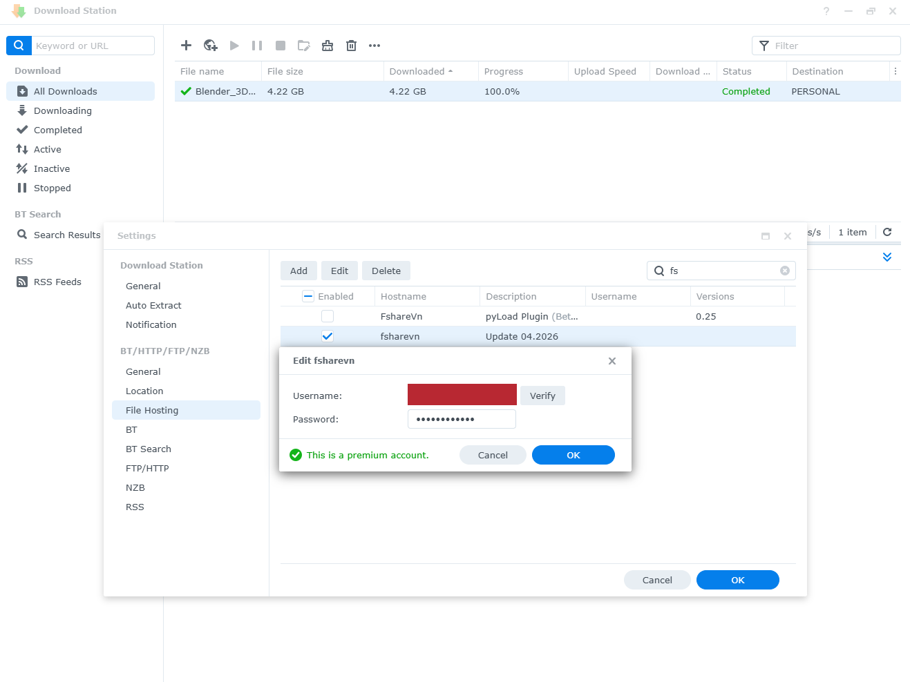
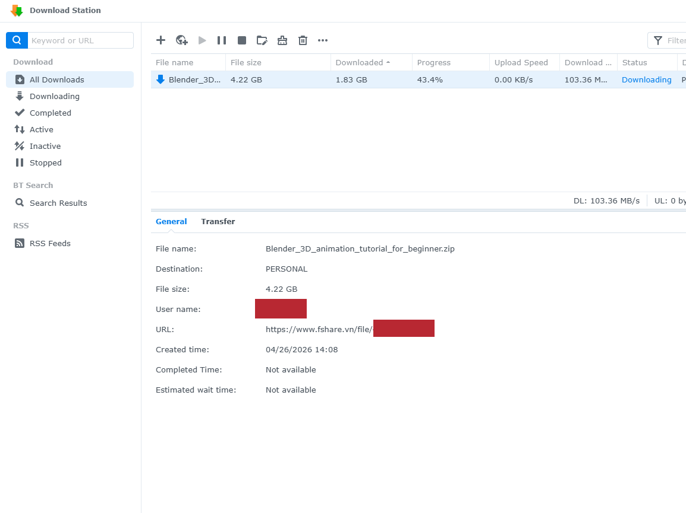

# Fshare.vn — Synology Download Station Host Module

Module tích hợp Fshare.vn vào Synology Download Station, cho phép tải file trực tiếp thông qua giao thức kết nối chính thức của Fshare.

---

## Yêu cầu

- Synology NAS với DSM 3.2 trở lên
- Download Station đã cài đặt
- Tài khoản Fshare.vn (Free hoặc VIP)

---

## Cài đặt

**1. Tải file**

Tải `FshareVn.host` từ repository này.

**2. Thêm vào Download Station**

Mở Download Station → Settings → File Hosting → Add → chọn `FshareVn.host`.

**3. Nhập thông tin tài khoản**

Chọn Fshare.vn → Edit → nhập email và mật khẩu Fshare → Verify.

| Kết quả | Ý nghĩa |
|---------|---------|
| Valid | Tài khoản VIP, sẵn sàng sử dụng |
| Free user | Tài khoản Free, tốc độ bị giới hạn |
| Login failed | Sai thông tin đăng nhập hoặc lỗi kết nối |



---

## Sử dụng

Dán link Fshare vào Download Station như bình thường:

```
https://www.fshare.vn/file/XXXXXXXXXX
```



---

## Lưu ý

Mã nguồn này không thu thập bất kỳ dữ liệu cá nhân nào của người dùng. Thông tin đăng nhập chỉ được sử dụng để xác thực trực tiếp với hệ thống Fshare và không được lưu trữ hay gửi đến bất kỳ bên thứ ba nào.

Module ưu tiên tái sử dụng phiên đăng nhập đã được lưu tạm trên thiết bị. Việc xác thực lại với hệ thống Fshare chỉ xảy ra khi phiên hiện tại hết hạn hoặc không còn hợp lệ.

Module sử dụng giao thức kết nối của Fshare không có khóa đăng ký chính thức. Fshare hiện đã tạm ngưng cấp quyền truy cập cho cá nhân. Người dùng tự chịu trách nhiệm khi sử dụng.

---

## Giấy phép

MIT

---
---

# Fshare.vn — Synology Download Station Host Module

A file hosting module that enables Synology Download Station to download files from Fshare.vn using Fshare's official service interface.

---

## Requirements

- Synology NAS with DSM 3.2 or later
- Download Station installed
- Fshare.vn account (Free or VIP)

---

## Installation

**1. Download**

Download `FshareVn.host` from this repository.

**2. Add to Download Station**

Open Download Station → Settings → File Hosting → Add → select `FshareVn.host`.

**3. Configure credentials**

Select Fshare.vn → Edit → enter your Fshare email and password → Verify.

| Result | Meaning |
|--------|---------|
| Valid | VIP account, ready |
| Free user | Free account, limited speed |
| Login failed | Invalid credentials or connection error |


---

## Usage

Paste any Fshare link into Download Station as usual:

```
https://www.fshare.vn/file/XXXXXXXXXX
```


---

## Disclaimer

This module does not collect any personal data. Credentials are used solely to authenticate with Fshare's service and are never stored or transmitted to any third party.

The module prioritizes reusing an existing session cached on the device. Re-authentication only occurs when the current session has expired or is no longer valid.

This module communicates with Fshare's service without an officially registered access key. Fshare has suspended access for individual developers. The author assumes no responsibility for any consequences arising from its use.

---

## License

MIT
